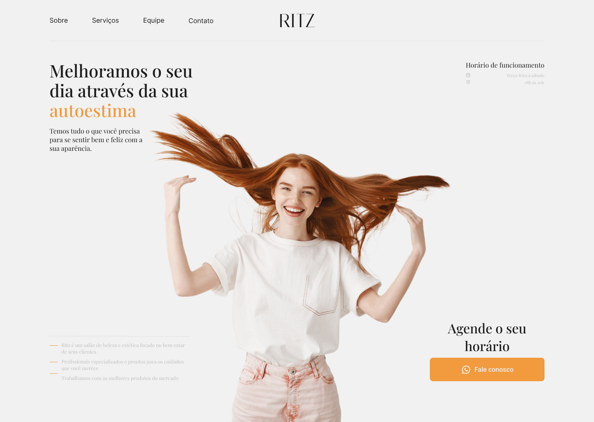
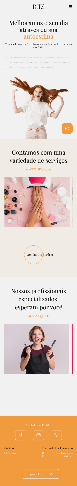

<h1 align="center">
  
</h1>

  
  
   
    
  </a>
 
  

  <a href="#%EF%B8%8F-about-the-project">About the project</a>&nbsp;&nbsp;&nbsp;|&nbsp;&nbsp;&nbsp;
  <a href="#-license">License</a>

## [🌌 See the prototype made on figma](https://www.figma.com/community/file/1212035552494817936)

## 🚘 About the project

website for a fictional beauty salon

## 📱 Mobile version
<h1 align="center">
  
</h1>

## 📝 License

This project is licensed under the MIT License - see the [LICENSE](LICENSE) file for details.

Made with 💜 &nbsp;by Gustavo Henrique 👋 &nbsp;[See my linkedin](https://www.linkedin.com/in/gustavohribeiro/)
